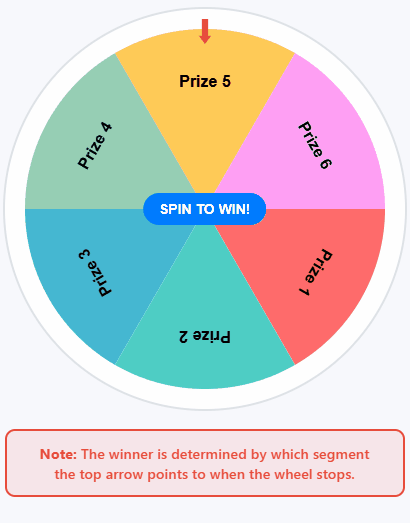

# React Prize Wheel

<p align="center">
  
</p>

<p align="center">
  <a href="https://www.npmjs.com/package/react-prize-wheel"></a>
  <a href="https://github.com/SensitiveWebUser/react-prize-wheel/blob/main/LICENSE"></a>
  <a href="https://github.com/SensitiveWebUser/react-prize-wheel/actions"></a>
  <a href="https://github.com/SensitiveWebUser/react-prize-wheel/stargazers"></a>
</p>

---

## 📑 Table of Contents

- [Overview](#overview)
- [Technical Architecture](#technical-architecture)
- [Getting Started](#-getting-started)
- [Install](#-install)
- [Usage](#-usage)
- [API Reference](#-api-reference)
- [Customization](#-customization)
- [Contributing](#-contributing)
- [License](#-license)

---

## Overview

React Prize Wheel is a customizable and interactive spinning wheel component built with React and TypeScript. Create a prize wheel with various options and spin it to select a random prize. Easily integrate into any React project and style to match your brand.

---

## ⚙️ Technical Architecture

- **Framework:** React (TypeScript)
- **Rendering:** Uses HTML5 Canvas for smooth, animated wheel rendering
- **Customization:** Props for segments, animation, pointer, theme, and callbacks
- **Integration:** Works with any React app, supports custom event handlers
- **Testing:** Includes unit tests for core logic and rendering

---

## 🚀 Getting Started

Clone the repository and run locally:

```bash
pnpm install
pnpm dev
```

Open [http://localhost:3000](http://localhost:3000) in your browser.

---

## 📦 Install

```bash
pnpm add react-prize-wheel
# or
npm install react-prize-wheel
# or
yarn add react-prize-wheel
```

---

## ✨ Usage (v2.0)

```tsx
import { SpinWheel, type WheelSegment } from "react-prize-wheel";

const segments: WheelSegment[] = [
  { id: "1", text: "Prize 1", color: "#ff6b6b" },
  { id: "2", text: "Prize 2", color: "#4ecdc4" },
  { id: "3", text: "Prize 3", color: "#45b7d1" },
];

function App() {
  const handleSpinComplete = (result) => {
    alert(`Spin completed! You won: ${result.segment.text}`);
  };

  return (
    <SpinWheel
      segments={segments}
      size={400}
      animation={{ duration: 4000, easing: "ease-out", spins: 8 }}
      pointer={{ style: "arrow", color: "#e74c3c", position: "top" }}
      theme={{ background: "#fff", border: "#ccc", text: "#222" }}
      onSpinComplete={handleSpinComplete}
      showSpinButton={true}
      spinButtonText="SPIN NOW"
    />
  );
}
```

#### Integration Tips

- Use `segments` for wheel options (each must have `id`, `text`, `color`)
- Control animation with the `animation` prop (duration, easing, spins)
- Customize pointer style and position
- Use `predefinedResult` for testing (by segment id or index)
- Use `onSpinComplete` to handle the result

---

## 📖 API Reference

### SpinWheelProps

| Prop | Type | Default | Description |
|------|------|---------|-------------|
| `segments` | `WheelSegment[]` | - | Array of segments to display |
| `size` | `number` | `400` | Size of the wheel in pixels |
| `onSpinComplete` | `(result: SpinResult) => void` | - | Callback when spin completes |
| `onSpinStart` | `() => void` | - | Callback when spin starts |
| `animation` | `Partial<AnimationConfig>` | - | Animation configuration |
| `pointer` | `Partial<PointerConfig>` | - | Pointer configuration |
| `theme` | `Partial<WheelTheme>` | - | Theme configuration |
| `disabled` | `boolean` | `false` | Whether the wheel is disabled |
| `showSpinButton` | `boolean` | `true` | Whether to show the spin button |
| `spinButtonText` | `string` | `'SPIN'` | Custom spin button text |
| `predefinedResult` | `number \| string` | - | Predefined result for testing |

### WheelSegment

```ts
interface WheelSegment {
  id: string;
  text: string;
  color: string;
  textColor?: string;
  weight?: number;
  borderColor?: string;
  borderWidth?: number;
  disabled?: boolean;
}
```

### SpinResult

```ts
interface SpinResult {
  segment: WheelSegment;
  index: number;
  angle: number;
  duration: number;
  timestamp: number;
}
```

### AnimationConfig

```ts
interface AnimationConfig {
  duration: number;
  easing: 'linear' | 'ease-in' | 'ease-out' | 'ease-in-out';
  spins: number;
}
```

### PointerConfig

```ts
interface PointerConfig {
  style: 'arrow' | 'triangle' | 'circle';
  color: string;
  size: number;
  position: 'top' | 'right' | 'bottom' | 'left';
}
```

### WheelTheme

```ts
interface WheelTheme {
  background: string;
  border: string;
  text: string;
}
```

---

## 🎨 Customization

### Weighted Segments

```tsx
const weightedSegments = [
  { id: '1', text: 'Common Prize', color: '#e74c3c', weight: 3 },
  { id: '2', text: 'Rare Prize', color: '#f39c12', weight: 1 },
  { id: '3', text: 'Epic Prize', color: '#9b59b6', weight: 0.5 },
];
```

### Animation Configuration

```tsx
<SpinWheel
  segments={segments}
  animation={{
    duration: 4000,        // 4 seconds
    easing: 'ease-out',    // CSS easing function
    spins: 8,              // Number of rotations
  }}
/>
```

### Pointer Customization

```tsx
<SpinWheel
  segments={segments}
  pointer={{
    style: 'arrow',        // 'arrow', 'triangle', 'circle'
    color: '#e74c3c',     // Pointer color
    size: 25,             // Size in pixels
    position: 'top',      // 'top', 'right', 'bottom', 'left'
  }}
/>
```

### Theme Configuration

```tsx
<SpinWheel
  segments={segments}
  theme={{
    background: '#ffffff', // Wheel background
    border: '#dee2e6',     // Border color
    text: '#212529',       // Text color
  }}
/>
```

---

## 🤝 Contributing

Contributions, issues and feature requests are welcome! Please:

- Fork the repo and submit a PR
- Open issues for bugs or feature requests
- See [issues page](https://github.com/SensitiveWebUser/react-prize-wheel/issues)

---

## 📝 License

This project is [MIT Licensed](LICENSE).

---

## 💬 Questions?

See the official npm documentation or open an issue on GitHub.

---
